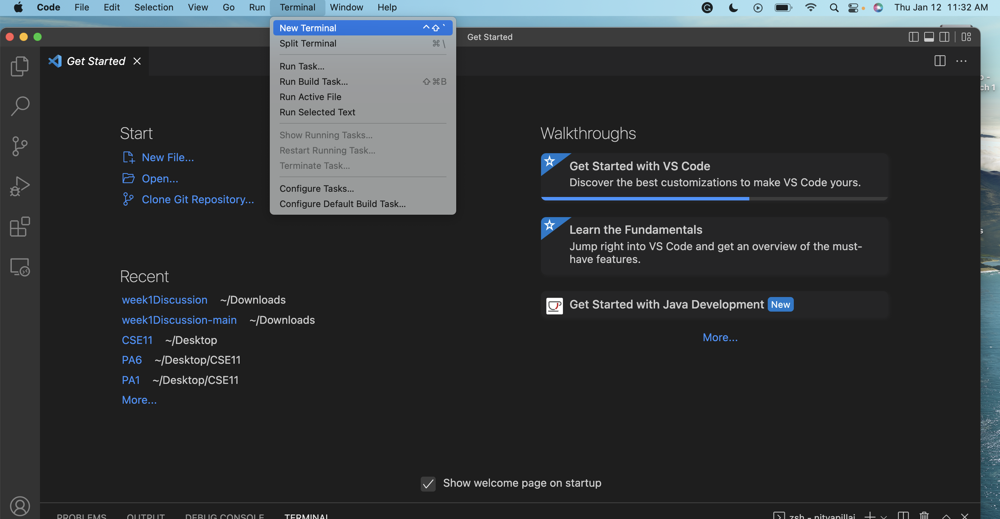

# Lab Report 1
Nitya Pillai | CSE 15L Thursday 10 am B270
## Installing VSCode
1. Visit the [VSCode Website](https://code.visualstudio.com/).
2. Make sure to specify the correct device (Mac/Windows/Linux).
3. Click the download button.


Once VSCode is downloaded, open the application. You should see a screen like this:


Then, go to the top navigation bar. Click "terminal", then "new terminal".



Once you have your terminal open, you're ready to try remotely connecting. 
## Remotely Connecting 
1. Find your UCSD CSE 15L account [here](https://sdacs.ucsd.edu/~icc/index.php) by inputting your UCSD username and PID. You will most likely have to reset your password as well.
2. Make sure to reset your password to a secure password that meets the specified requirements. Then you will need to wait about 15 minutes for your new password to update. 

3. Once your password has updated,you should  see a screen with your account lookup results:

4. Copy the contents of course specific ID and return to the VSCode terminal you opened in the previous section. 
5. Type the following command into the terminal: ```ssh [YOUR_COPIED_COURSE_SPECIFIC_ID]@ieng6.ucsd.edu```
6. When promped "Are you sure you want to continue connecting?", type yes and enter your NEW password.
7. You should see an output like below. You are now connected to the remote server!


## Trying Some Commands
- In order to display the current working directory, type ```pwd``` in the terminal. 
- If you want to list all the files in a directory, use the ```ls``` command. 
- To copy files into a directory, use the ```cp``` command.
- If you want to display the contents of a file, use the ```cat``` command.
- Use the ```exit``` command when you are finished to log out. 


