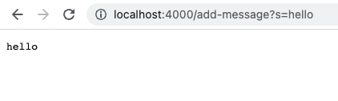
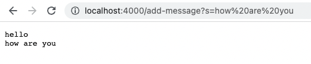
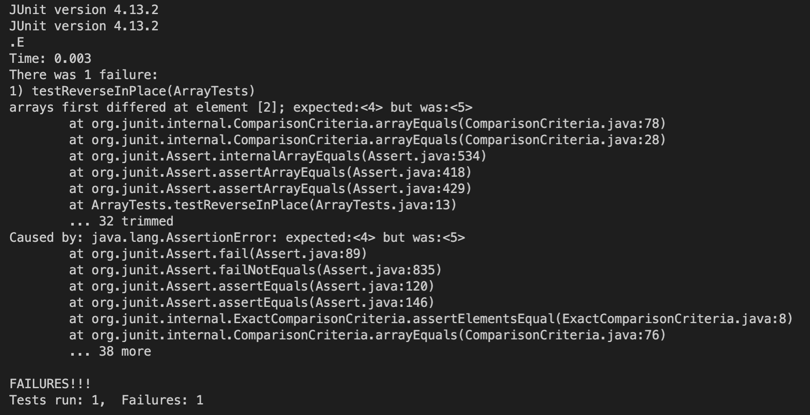

# Lab Report 2
Nitya Pillai | CSE 15L Thursday 10 am B270
## Part 1: StringServer
In the screenshotted output below, the ```handleRequest``` method is called in my code. This method takes a parameter of ```URI url```. This parameter is essentially the URL that the user types in. We will preform checks on this URL in the method in order to produce specific outputs on the page. In this case, the argument passed to the method would be the path, '''/add-message?s=hello'''.



In my code, I defined a variable ```str``` to hold the string that will be added to and outputted on the page. It is initially initialized as empty. However, by passing ```/add-message?s=hello``` as an argument in the handleRequest method, ```str``` is updated to be ```hello```.

Since the URL containes "/add-message", the first if statement returns true. The path is then split at the equal sign. A String array ```parameters``` is initialized with the string before and after the equal sign. Since the string before the equal sign contains "s", the second element in ```parameters``` (the String the user wants to output) is appended to ```str``` along with a new line. In this case, ```str``` is updated to ```hello``` and this value is returned and outputted on the page.

```
import java.io.IOException;
import java.net.URI;

class Handler implements URLHandler 
{
    String str = "";

    public String handleRequest(URI url) 
    {
        if (url.getPath().contains("/add-message")) 
        {
            String[] parameters = url.getQuery().split("=");
            if (parameters[0].equals("s")) 
            {
                str += parameters[1] + "\n";
                return str;
            } 
        }
        
        return "404 Not Found!";
        
    }    
}
```

It is also important to note that variables are also updated in the main method of the StringServer class. The main method takes a command line argument that is used as the port number for the server. Then, the server is started and a new Handler object is created in the process which allows different URL request to be made based on the method specified above.

```
class StringServer {
    public static void main(String[] args) throws IOException {
        if(args.length == 0){
            System.out.println("Missing port number! Try any number between 1024 to 49151");
            return;
        }

        int port = Integer.parseInt(args[0]);

        Server.start(port, new Handler());
    }
}
```

In the second screenshotted output below, the user adds another message after their previous one. This once again calls the ```handleRequest(URI url)``` method in the Handler class. This time, ```str``` already holds a value from the previous input ```hello```. Since "/add-message" is part of the URL passed into the method ```/add-message?s=How are you``` and the path has the appropriate formatting with "s=", the ```How are you``` is appended to ```str```. The updated value of ```str``` is returned and outputted to the page as seen below.



## Part 2: Bugs from Lab 3
Failure Inducing Input
```
import static org.junit.Assert.*;
import org.junit.*;

public class ArrayTests {
	@Test 
	public void testReverseInPlace() {
        int[] input2 = {3, 4, 5, 6};
        ArrayExamples.reverseInPlace(input2);
        assertArrayEquals(new int[]{6, 5, 4, 3}, input2);
	}
}
```
```
public class ArrayExamples {

  // Changes the input array to be in reversed order
  static void reverseInPlace(int[] arr) {
    for(int i = 0; i < arr.length - 1; i += 1) {
      arr[i] = arr[arr.length - i - 1];
    }
  }
}
```
The purpose of the ```reverseInPlace``` method is to reverse the given array of integers, modifying the array passed as an argument to the method. Here, the failure inducing input occurs when the array contains more than one element. Looping through the array, elements are being modified. However, because of this, since the value of later elements in the array depend on earlier elements, the updated values of these earlier elements are used in calculation rather than the original ones. 

Input that does NOT induce a failure
```
import static org.junit.Assert.*;
import org.junit.*;

public class ArrayTests {
	@Test 
	public void testReverseInPlace() {
        int[] input1 = { 3 };
        ArrayExamples.reverseInPlace(input1);
        assertArrayEquals(new int[]{ 3 }, input1);
    }
}
```
```
public class ArrayExamples {

  // Changes the input array to be in reversed order
  static void reverseInPlace(int[] arr) {
    for(int i = 0; i < arr.length - 1; i += 1) {
      arr[i] = arr[arr.length - i - 1];
    }
  }
}
```
An input array of size one does not induce a failing output as the reversed version of the array would just be the original array.

Symptom



The input array for the failed test should have been modified from {3, 4, 5, 6} to {6, 5, 4, 3}. However, it was modified to {6, 5, 5, 6}. This is the symptom of the bug and is due to the fact that the original values in the array which are being used to determine the new reversed values are also changing as we traverse through the array. 

Bug Before:
```
public class ArrayExamples {

  static void reverseInPlace(int[] arr) {
    for(int i = 0; i < arr.length - 1; i += 1) {
      arr[i] = arr[arr.length - i - 1];
    }
  }
}
```
Bug After:
```
public class ArrayExamples {

  static void reverseInPlace(int[] arr) {
    int[] tempArr = new int[arr.length];
    for(int i = 0; i < arr.length - 1; i += 1) {
      tempArr[i] = arr[arr.length - i - 1];
    }
    tempArr[arr.length - 1] = arr[0];
    
    for(int i = 0; i < arr.length; i++)
    {
        arr[i] = tempArr[i];
    }
  }
  
}
```
To fix the bug, create an empty array of integers ```tempArr```. Then loop through ```arr``` in reverse and add these elements to ```tempArr```. This will ensure that the original values of the input array are reversed and not modified along the way. Finally, initialize ```arr``` with the new values from ```tempArr```.

Part 3:
Something new that I learned in the past weeks was how to build and run a remote server. I had hosted websites on servers before, but I never really understood what the actual URL path meant until now. Now, I know that the path indicates that the page is running from a local host and we can specify a port number to run it on. I also got to practice using JUnit more and I learned that just because code works on a few tests does not mean it is full proof. It is improtant to conduct further testing to find failure inducing inputs, identify symptoms of them, and be able to come to a solution on how to fix the bug. I learned that a bug is something that does not produce the right output and is not necessarily just any error. 
